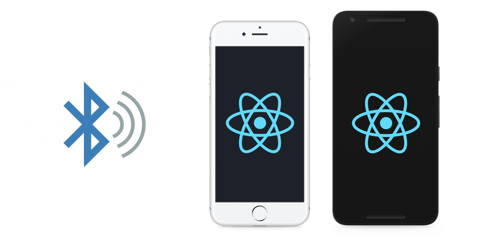
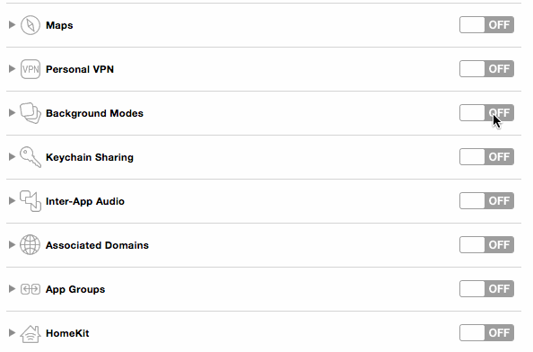

[](https://github.com/MacKentoch/react-native-beacons-manager)

# react-native-beacons-manager



`react-native-beacons-manager`: add beacon technology in your React Native application for both iOS and Android.

This repository is born to keep alive and up to date these 2 original awesome:
- [ibeacon for android](https://github.com/mmazzarolo/react-native-beacons-android)
- [ibeacon for iOS](https://github.com/frostney/react-native-ibeacon)

If you want to know more about just have a look at [my medium article](https://medium.com/@erwan.datin/mmazzarolohow-to-play-with-ibeacons-in-a-react-native-application-5cef754b2edc#.e2bvgplvy).

## Install (iOS and Android)

> Ensure to have NodeJS >= v6.x.
>
> You must run on **real devices** (*don't forget to active Bluetooth when running*).

**Mobile Version compatibility:**

> - **iOS** `minimum version`
>   -  8.0
> - **Android** `minimum version`
>   - 21 (*alias LOLLIPOP*)


### 1. get modules
*via npm:*
```javascript:
npm install react-native-beacons-manager
```
*or via yarn:*
```javascript:
yarn install react-native-beacons-manager
```
### 2. link to your application

```javascript
react-native link react-native-beacons-manager
```
### 3.a configuration specific to iOS

> IMPORTANT: you have to set `Bluetooth` and `localization service` in background Modes




### 3.b configuration specific to Android

Nothing (lucky Android :smile:).


## 4 usage

### 4.a iOS

#### Simple example

```javascript
var React = require('react-native');
var {DeviceEventEmitter} = React;

var Beacons = require('react-native-beacons-manager');

// Define a region which can be identifier + uuid,
// identifier + uuid + major or identifier + uuid + major + minor
// (minor and major properties are numbers)
var region = {
    identifier: 'Estimotes',
    uuid: 'B9407F30-F5F8-466E-AFF9-25556B57FE6D'
};

// Request for authorization while the app is open
Beacons.requestWhenInUseAuthorization();

Beacons.startMonitoringForRegion(region);
Beacons.startRangingBeaconsInRegion(region);

Beacons.startUpdatingLocation();

// Listen for beacon changes
var subscription = DeviceEventEmitter.addListener(
  'beaconsDidRange',
  (data) => {
    // data.region - The current region
    // data.region.identifier
    // data.region.uuid

    // data.beacons - Array of all beacons inside a region
    //  in the following structure:
    //    .uuid
    //    .major - The major version of a beacon
    //    .minor - The minor version of a beacon
    //    .rssi - Signal strength: RSSI value (between -100 and 0)
    //    .proximity - Proximity value, can either be "unknown", "far", "near" or "immediate"
    //    .accuracy - The accuracy of a beacon
  }
);
```

#### API

| Method                            | Description                                                                                                                                                                                                                                                                                                                                                                                                                                                                                                                                                                                                                                   |
|:----------------------------------|:----------------------------------------------------------------------------------------------------------------------------------------------------------------------------------------------------------------------------------------------------------------------------------------------------------------------------------------------------------------------------------------------------------------------------------------------------------------------------------------------------------------------------------------------------------------------------------------------------------------------------------------------|
| **requestWhenInUseAuthorization** | This method should be called before anything else is called. It handles to request the use of beacons while the application is open. If the application is in the background, you will not get a signal from beacons. Either this method or `Beacons.requestAlwaysAuthorization` needs to be called to receive data from beacons.                                                                                                                                                                                                                                                                                                             |
| **requestAlwaysAuthorization**    | This method should be called before anything else is called. It handles to request the use of beacons while the application is open or in the background. Either this method or `Beacons.requestWhenInUseAuthorization` needs to be called to receive data from beacons.                                                                                                                                                                                                                                                                                                                                                                      |
| **getAuthorizationStatus**        | This methods gets the current authorization status. While this methods provides a callback, it is not executed asynchronously. The values `authorizedAlways` and `authorizedWhenInUse` correspond to the methods `requestWhenInUseAuthorization` and `requestAlwaysAuthorization` respectively.                                                                                                                                                                                                                                                                                                                                               |
| **startMonitoringForRegion**      | When starting monitoring for beacons, we need to define a region as the parameter. The `region` is an object, which needs to have at least two values: `identifier` and `uuid`. Additionally, it can also have a `major`, `minor` version or both. Make sure to not re-use the same identifier. In that case, we won't get the data for the beacons. The corresponding events are `regionDidEnter` and `regionDidExit`.                                                                                                                                                                                                                       |
| **startRangingBeaconsInRegion**   | When ranging for beacons, we need to define a `region` as the parameter. The `region` is an object, which needs to have at least two values: `identifier` and `uuid`. Additionally, it can also have a `major`, `minor` version or both. Make sure to not re-use the same identifier. In that case, we won't get the data for the beacons. The corresponding events are `beaconsDidRange`. The event will fire in every interval the beacon sends a signal, which is one second in most cases. If we are monitoring and ranging for beacons, it is best to first call `startMonitoringForRegion` and then call `startRangingBeaconsInRegion`. |
| **startUpdatingLocation**         | This call is needed for monitoring beacons and gets the initial position of the device.                                                                                                                                                                                                                                                                                                                                                                                                                                                                                                                                                       |
| **stopUpdatingLocation**          | This method should be called when you don't need to receive location-based information and want to save battery power.                                                                                                                                                                                                                                                                                                                                                                                                                                                                                                                        |
| **shouldDropEmptyRanges**         | Call this method to stop sending the `beaconsDidRange` event when the beacon list is empty. This can be useful when listening to multiple beacon regions and can reduce cpu usage by 1-1.5%.                                                                                                                                                                                                                                                                                                                                                                                                                                                  |

                                                                                                                                                                                                                             |
| Event                      | Description                                                                                                                                                                                                                                                                                                                                     |
|:---------------------------|:------------------------------------------------------------------------------------------------------------------------------------------------------------------------------------------------------------------------------------------------------------------------------------------------------------------------------------------------|
| **beaconsDidRange**        | This event will be called for every region in every beacon interval. If you have three regions you get three events every second (which is the default interval beacons send their signal). When we take a closer look at the parameter of the callback, we get information on both the region and the beacons.                                 |
| **regionDidEnter**         | If the device entered a region, `regionDidEnter` is being called. Inside the callback the parameter we can use returns an object with a property `region` that contains the `region` identifier value as a string. Additionally, we get the UUID of the region through its `uuid` property.                                                     |
| **regionDidExit**          | In the same `regionDidEnter` is called if the device entered a region, `regionDidExit` will be called if the device exited a region and we can't get any signal from any of the beacons inside the region. As for the payload, we get a property called `region` that represents the `region` identifier and is a string as well as the `uuid`. |
| **authorizationDidChange** | When the user permissions change, for example the user allows to always use beacons, this event will be called. The same applies when the user revokes the permission to use beacons. The payload is a string which can either be: `"authorizedAlways"`, `"authorizedWhenInUse"`, `"denied"`, `"notDetermined"` or `"restricted"`               |


### 4.b Android

#### Simple example

```javascript
import { DeviceEventEmitter } from 'react-native'
import Beacons from 'react-native-beacons-manager'

// Tells the library to detect iBeacons
Beacons.detectIBeacons()

// Start detecting all iBeacons in the nearby
try {
  await Beacons.startRangingBeaconsInRegion('REGION1')
  console.log(`Beacons ranging started succesfully!`)
} catch (err) {
  console.log(`Beacons ranging not started, error: ${error}`)
}

// Print a log of the detected iBeacons (1 per second)
DeviceEventEmitter.addListener('beaconsDidRange', (data) => {
  console.log('Found beacons!', data.beacons)
})
```

#### API

| Method                                                                                            | Description                                                                                                                                                                                                                                                                                                                                                                                                                                                                                                                                                                        |
|:--------------------------------------------------------------------------------------------------|:-----------------------------------------------------------------------------------------------------------------------------------------------------------------------------------------------------------------------------------------------------------------------------------------------------------------------------------------------------------------------------------------------------------------------------------------------------------------------------------------------------------------------------------------------------------------------------------|
| **detectCustomBeaconLayout(parser: string): void**                                                | Allows the detection of a custom beacon layout. For example `detectCustomBeaconLayout('m:0-3=4c000215,i:4-19,i:20-21,i:22-23,p:24-24')` allows you to detect iBeacons beacons.                                                                                                                                                                                                                                                                                                                                                                                                     |
| **detectIBeacons(): void**                                                                        | Allows the detection of iBeacons. It's just like calling detectCustomBeaconLayout with the iBeacons layout.                                                                                                                                                                                                                                                                                                                                                                                                                                                                        |
| **detectEstimotes(): void**                                                                       | Allows the detection of Estimote beacons. It's just like calling `detectCustomBeaconLayout` with the Estimote layout.                                                                                                                                                                                                                                                                                                                                                                                                                                                              |
| **checkTransmissionSupported(): promise**                                                         | Checks if the device can use the Bluetooth to detect the beacons.                                                                                                                                                                                                                                                                                                                                                                                                                                                                                                                  |
| **setForegroundScanPeriod(period: number): void**                                                 | Sets the duration in milliseconds of each Bluetooth LE scan cycle to look for beacons (in foreground). For more info [take a look at the official docs](https://altbeacon.github.io/android-beacon-library/javadoc/index.html)                                                                                                                                                                                                                                                                                                                                                     |
| **setBackgroundScanPeriod(period: number): void**                                                 | Sets the duration in milliseconds of each Bluetooth LE scan cycle to look for beacons (in background). For more info [take a look at the official docs](https://altbeacon.github.io/android-beacon-library/javadoc/index.html)                                                                                                                                                                                                                                                                                                                                                     |
| **setBackgroundBetweenScanPeriod(period: number): void**                                          | Sets the duration in milliseconds spent not scanning between each Bluetooth LE scan cycle when no ranging/monitoring clients are in the foreground. For more info [take a look at the official docs](https://altbeacon.github.io/android-beacon-library/javadoc/index.html)                                                                                                                                                                                                                                                                                                        |
| **setHardwareEqualityEnforced(e: boolean): void**                                                 | Configures whether the bluetoothAddress (mac address) must be the same for two Beacons to be configured equal. This setting applies to all beacon instances in the same process. Defaults to false for backward compatibility. Useful when all the beacons you are working with have the same UUID, major and minor (they are only uniquely identifiable by their mac address), otherwise the module will detect all the beacons as if they were only one. For more info [take a look at the official docs](https://altbeacon.github.io/android-beacon-library/javadoc/index.html) |
| **getRangedRegions(): promise**                                                                   | Returns a promise that resolves in an array with the regions being ranged.                                                                                                                                                                                                                                                                                                                                                                                                                                                                                                         |
| **getMonitoredRegions(): promise**                                                                | Returns a promise that resolves in an array with the regions being monitored.                                                                                                                                                                                                                                                                                                                                                                                                                                                                                                      |
| **startMonitoringForRegion({identifier: string, uuid: string, minor: int, major: int}): promise** | Starts monitoring for beacons. The parameter `identifier` must be an unique ID. The parameter uuid is optional, it allows you to detect only the beacons with a specific UUID (if `null` every beacon will be detected). The parameters `minor` and `major` are optional, they allow you to monitor only the region of a specific beacon.                                                                                                                                                                                                                                          |
| **startRangingBeaconsInRegion(regionId: string, beaconsUUID: string): promise**                   | Starts range scan for beacons. The parameter `regionId` must be an unique ID. The parameter `beaconsUUID` is optional, it allows you to detect only the beacons with a specific UUID (if `null` every beacon will be detected).                                                                                                                                                                                                                                                                                                                                                    |
| **stopMonitoringForRegion({identifier: string, uuid: string, minor: int, major: int}): promise**  | Stops the monitoring for beacons.                                                                                                                                                                                                                                                                                                                                                                                                                                                                                                                                                  |
| **stopRangingBeaconsInRegion(regionId: string, beaconsUUID: string): promise**                    | Stops the range scan for beacons.                                                                                                                                                                                                                                                                                                                                                                                                                                                                                                                                                  |


## license
The MIT License (MIT)

Copyright (c) 2017 Erwan DATIN

Permission is hereby granted, free of charge, to any person obtaining a copy
of this software and associated documentation files (the "Software"), to deal
in the Software without restriction, including without limitation the rights
to use, copy, modify, merge, publish, distribute, sublicense, and/or sell
copies of the Software, and to permit persons to whom the Software is
furnished to do so, subject to the following conditions:

The above copyright notice and this permission notice shall be included in all
copies or substantial portions of the Software.

THE SOFTWARE IS PROVIDED "AS IS", WITHOUT WARRANTY OF ANY KIND, EXPRESS OR
IMPLIED, INCLUDING BUT NOT LIMITED TO THE WARRANTIES OF MERCHANTABILITY,
FITNESS FOR A PARTICULAR PURPOSE AND NONINFRINGEMENT. IN NO EVENT SHALL THE
AUTHORS OR COPYRIGHT HOLDERS BE LIABLE FOR ANY CLAIM, DAMAGES OR OTHER
LIABILITY, WHETHER IN AN ACTION OF CONTRACT, TORT OR OTHERWISE, ARISING FROM,
OUT OF OR IN CONNECTION WITH THE SOFTWARE OR THE USE OR OTHER DEALINGS IN THE
SOFTWARE.
