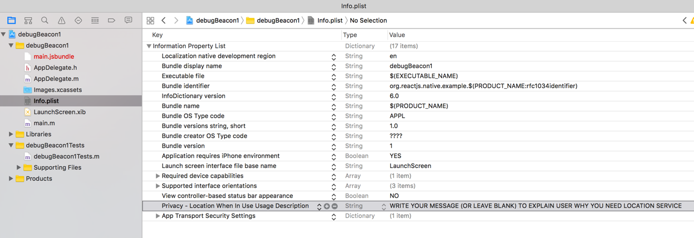
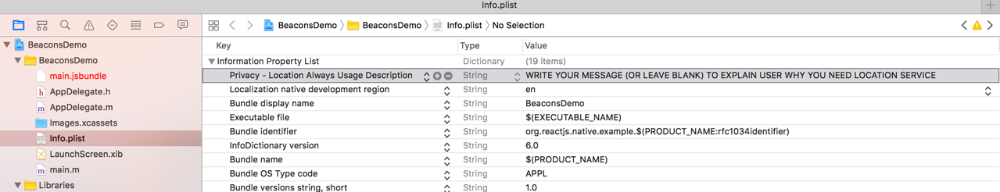

# Fully detailed documentation for "ranging beacons in iOS"

This documentation give a deeper explanation on how to range (*but ranging only*) beacon in iOS.

This documentation is linked to the sample code [monitoring.ios.js](./monitoring.ios.js)

## 1- request authorization

When dealing with Beacons, you technically deal with native location ([see Apple documentation](https://developer.apple.com/reference/corelocation/cllocationmanager)).

Before starting ranging, iOS force you to ask for authorization in case of location services.

If you don't:
- it won't generate an error
- but nothing will happen until you have authorization


You can request 2 kind of authorizations depending on the use case:
> Do you need background capability or not?


### 1.a `Beacons.requestWhenInUseAuthorization();` (**foreground** only use-case)

#### in your react native application
Ensure to call ```javascript
Beacons.requestWhenInUseAuthorization();
```

#### in your iOS project

To be effective your `info.plist` file should have `Privacy - Location When In Use Usage Description` key defined (*empty value or not. It is better to define a value to a custom / more user-friendly message*).

By chance `react-native init YOUR_APP_NAME` should have already set it for you in your `info.plist` file.

*Just check it:*



### 1.b `Beacons.requestAlwaysAuthorization();` (**background use-case**)

To be effective your `info.plist` file should have `Privacy - Location Always Usage Description` key defined (*empty value or not. It is better to define a value to a custom / more user-friendly message*).

*You have to manually `add it` to your `info.plist`:*


